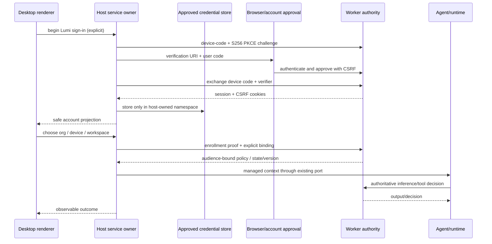

# Desktop/backend integration closure

Status: active; coordinator: this goal session. Base control plane a6de5e0,
client baseline fd977fd. Historical P08 closure remains historical; this plan
closes actual desktop wiring, not another backend-only phase.

## Contracts and execution sequence

Consume P02-CG v2, P03-CG v1, P04/P05/P06/P08-CG v1 and current change requests.
No frozen changes assumed. Missing contracts require explicit Change Requests.

| Packet | Responsibility / write surface | Dependencies |
|---|---|---|
| DE2E-INT-01 | Client spec and host account transport, shared service contract, credential persistence, isolated tests | P02 merged auth contract |
| DE2E-FE-01 | Desktop account/approval UI, existing service/hook boundary; backend desktop approval surface if missing | INT-01 |
| DE2E-INT-02 | Device key/enrollment/refresh/policy and explicit workspace adoption with storage/restart/rollback | INT-01, P03/P08 |
| DE2E-FE-02 | Enrollment wizard, ownership/policy/credential UX, remediation | INT-02 |
| DE2E-INT-03 | Actual managed provider/run/tool IPC runtime wiring, attribution and settlement | INT-02, P04/P05 |
| DE2E-INT-04 | Import preview, scheduler claim/fence/start/settle and coexistence | INT-03, P06 |
| DE2E-QA-01 | Electron clean-profile harness, UI/runtime/storage hostile controls, faults, performance | each slice continuously |
| DE2E-DEL-01 | compatibility matrix, recovery docs, both PRs and authorized delivery/pin update | QA |

Each packet gets its own definition before code. Coordinator owns shared-file
registries and review. No agents delegated initially; execute sequentially.
Implementation paths will be frozen after client architecture context inspection.

## State ownership / sequence

ZCode/provider OAuth retains its own existing owner. Lumi context cannot replace
active provider credentials. Renderer receives projections, never session keys.

## Baseline gap matrix (source evidence, runtime still UNPROVEN)

| Claim | Evidence / gap | Verdict |
|---|---|---|
| Lumi account auth contract | routes/device_auth.rs issues session/CSRF cookies after S256 exchange; not a bearer token | source confirmed, runtime UNPROVEN |
| Browser verification route | start returns /desktop; inspect frontend route and approval UX before assuming it exists | UNPROVEN |
| Client adoption | packages/shared and CLI contracts P08 wizard exist; PR49 adapter is test-owned | module proven historically, product wiring UNPROVEN |
| Existing provider login | services/oauth/IOAuthService owns provider flows/credentials and cached-session state | source confirmed, preservation tests pending |
| Device lifecycle | backend enrollment/token/policy routes; full desktop owner/wiring not yet traced | UNPROVEN |
| Managed inference/tools | provider/shared/runtime seams present; actual desktop callers must be traced | UNPROVEN |
| Scheduler adoption | P06 lease schemas exist; actual scheduler owner/wiring must be traced | UNPROVEN |
| Local state survival | no actual Electron old-state/restart/rollback evidence in PR49 | UNPROVEN |
| A–E Electron integration | missing product harness and user journey proof | UNPROVEN |

## Evidence and completion

Full goal remains authoritative: A–E actual Electron, hostile runtime/state
checks, reversible local migration, both repo quality/build gates, versioned
compatibility and focused PR handoffs. History sync remains disabled. No
production credentials/resources are touched for fixtures. Preserve ZCode login.
No merge authorization is inferred from the completed PR49 merge request.
